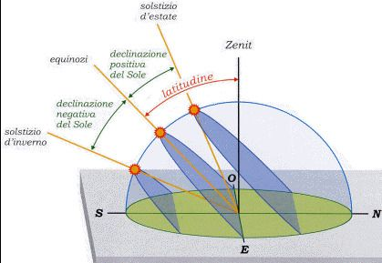
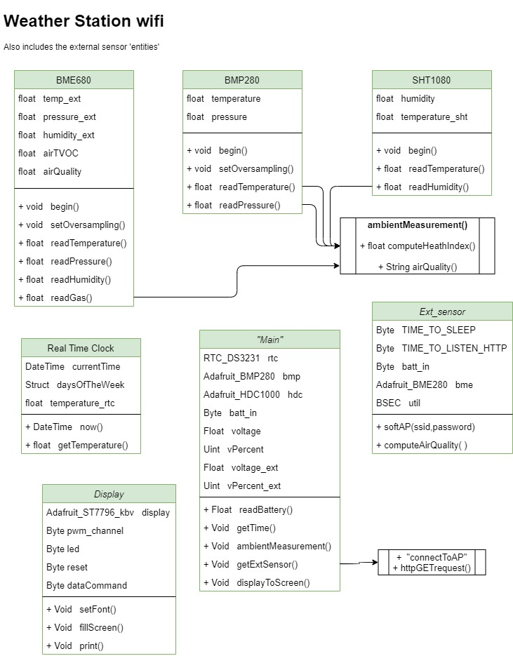
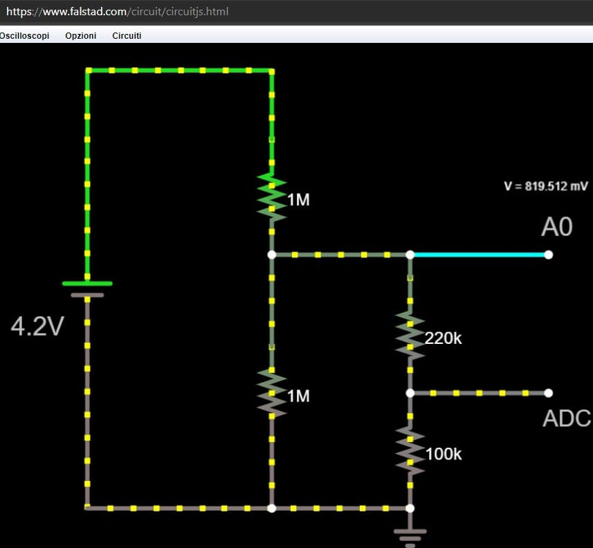

# Weather Station w/ wireless External Sensor and Web Forecast

The aim of this project is to build a very complete weather station with forecast, clock and date.  
This device measures the most relevant ambient parameters, like:

- Temperature
- Pressure
- Humidity  
(all three in & out)  

- Air quality index - tVOC  (with textual indication).
- Heat index (Humidex)
- Battery voltage and percentage (both in & out)

>Illuminance is intentionally not measured because of the need to expose the control unit to the direct sun.  
In addition a single light sensor would not be able to give a correct reading because of the parabolic trajectory of the sun.  
Furthermore, the movement path of the sun is not the same during an year nor in different latitudes.
>
>Similar argumentation for the wind gusts and direction: very bulky sensor and usually not so relevant (at least in my location).  

<br><br>

The core of all is an *ESP-32 Dev.board* but an external wireless "probe", created via an *ESP8266 D1 Mini*, is used to outside ambient surveys.  
By connecting to its SoftAP wireless network, this smaller control unit will answer to HTTP requests and send sensor data in the payload to the *"master"*.

In addition to the local captured data, a **weather forecast** is downloaded by a free online weather API such as [OpenWeatherMap](https://openweathermap.org/).  

All the information will be displayed on a **TFT screen** to achieve a fine eye-looking result.  

The project is developed in **Arduino code language (Wiring)**, to get an easy to understand and multi-platform environment.

### Credits and licence notes
All my code is *free and open source* but...  
**Any redistribution or reproduction of any part of the contents, in any form is prohibited**, following this rules:

1. It can be used just for non-commercial use and by indicating my name [@Alesimattia](https://github.com/alesimattia/Weather-station-wifi) and my references alesimattia@gmail.com  
2. It is in any case prohibited to transmit it or store it in any other website or other form of electronic retrieval system for commercial purposes.

All the libraries I used are free and installable by the Arduino library manager. 

>You can freely contact me for any questions or improvements at my email [alesimattia@gmail.com](mailto:alesimattia@gmail.com)  
I'm not an English native speaker so there may be some grammatical errors sometimes. :satisfied:

## Bill of Materials

- ESP32 Dev-board (or whatever microcontroller you like).
- ESP8266 D1 Mini &nbsp; &rarr; *External*
- BME280: &nbsp; temperature, pressure and humidity.
- BME680: &nbsp; temperature, pressure, humidity, total volatile-organic-compounds  &rarr; *External*
- DS3231 &nbsp; Real time clock
- TP4065 &nbsp; li-ion battery charger (x2) + 1N4007 diode (not the best)
- 18650 Battery &nbsp;(x2)
- TFT Display - 4.0" ST7796S (or whatever you like)
- 1 MOhm resistors &nbsp; (x4)
- Two housing cases
- Matrix board &nbsp; *(optional)*

All components can be bought on the most famous sites: cheap [Aliexpress](www.aliexpress.com) or [Adafruit](www.adafruit.com)

#### Notes on components

1. Aliexpress scammed me so I got a BMP280 (no humidity) so in this project will be used a **BMP280** coupled with a HDC1080.  
Code would even be simpler (and lightweight) with a single ambient sensor.
2. Real time clock might be superfluous with an ESPxx but it has got an embedded button cell battery (CR2032) so time keeping is guaranteed. Thus no need to reprogram with a PC even in case of completely loosing power.

## Class Diagram

Portrays the components properties and functions.  
Even if we are not describing a real object language classes, this diagram gives an **overview** of the components and their interactions.



## Display

In this project i'm using a 4.0" 480x320px TFT display with ST7796S controller (maybe not the most widespread, but good price-to-size on AliEx.)  
More documentation on <http://www.lcdwiki.com/4.0inch_SPI_Module_ST7796>.  

After have tested Adafruit_GFX (plus Adafruit_TFTSPI) library I found I got very low performances during screen refresh.   

At the moment, the best and optimized (for ESPs) library is [TFT_eSPI](https://github.com/Bodmer/TFT_eSPI) which also supports a lot of display controllers.  
Compared to the Adafruit one is blazing fast!  
The ***configuration header*** can be found in  [User_Setup.h](./docs/User_Setup.h)

##### NOTES #####

1. In ***Hardware SPI*** we get better performance so pay attention to this.  
2. For somewhat reason I ***couldn't reach full 80Mhz*** speed but 79'99999Hz is working perfectly.
3. **Touch screen** has not been used: maybe I will implement a touch display-dimming function in the future.  
4. Display dimming is code-scheduled to reduce eyestrain during the night hours.


### Images

Picture are stored in the ESP filesystem by mapping in RGB565 format (uint16_t array).

```cpp
const unsigned short img[] = PROGMEM {}
const uint16_t img[] = PROGMEM {}
```

You can use [Image2Bitmap](./docs/Image2Bitmap.exe) software for the **mapping**, then  
`TFT_eSPI::pushImage( )` is the public method for displaying to the screen.  
Another online software is: http://www.rinkydinkelectronics.com/t_imageconverter565.php

The main aim is to display a small icon of the weather forecast: this data is downloaded by a free web service such as [OpenWeatherMap](https://openweathermap.org/) with an HTTP call.  

Note that **images size** can't be dinamically resized and when displayed on the screen it must be "printed" with its actual size: the *pushImage()* method must get as parameters full image size.
>I.e. you can't (map in array) a 1920x1080px image and then scale down to 480x320px to fit the screen &rarr; **resize image before mapping** in array.

Background-filling colors and font colors also, are expressed in Hex RGB565 and can be converted with <http://drakker.org/convert_rgb565.html>
or using a 24bit rgb:

```cpp
TFT_eSPI::setTextColor( TFT_eSPI::color565(255,255,255) );
```
### Fonts
Included fonts may not be the best suitable basing on the display size or aims so we can include our custom font.  
I got some nice ones (I definitely HATE serif fonts ones :sweat_smile: ) on this font converter: <http://oleddisplay.squix.ch/#/home>  
Select: *"Library version: Adafruit GFX font"*  

I also created a [custom header file](./docs/Custom_font.h) which suits my display size.  You only have to copy that in the TFT_eSPI main folder, and include it.
> I suggest to NOT USE <code>TFT_eSPI::setTextSize(n);</code>  
with n>1 as it results in more aliased text displaying.  
At cost of a bit more memory, generate the font with the correct size.

## Battery measurement

1. *ESP32*  
Since ADC2 can't be used while the WiFi transceiver is active, the 12-bit resolution of the ***ADC1*** will map the input voltage from 0 to 3.3 Vdc to byte values of 0 to 4,095.  
Max input voltage on all GPIO can be 3.3V so we have to reduce the 5.1V (Usb chargers output) to an acceptable value.  

    To minimize current draw we add a [voltage divider](https://ohmslawcalculator.com/voltage-divider-calculator) with R1=R2=1M Ohm.  
Thus, the readings are attenuated by a factor of R2/(R1+R2) and because of equal resistors, the resulting ***attenuation*** is 2 &nbsp; &#8594; &nbsp; we multiply the readings by 2.

2. *ESP8266 D1 mini*  
This board has got just a single analog input pin *'A0'*.  
An internal voltage divider with 220KOhm and 100KOhm, applied in *A0-ADC* is used to upscale 1.1V maximum ADC voltage to 3.3V.  

    In this case too, we add an external voltage divier to expand the measurable range.

 &nbsp;&nbsp;&nbsp;

<br><br>

As we can see in the circuit simulator, the effective down-scaling ratio is *(4.2/0.819512 = 5.125)* so we can ***measure up to 3.3V\*5.125 = 16.9V***

Since map() function is using integer calculations

```cpp
 vPercent = map(voltage, 3.20 , 4.20, 0, 100);
```

Will not work. So I implemented a custom voltage-mapping function with lower voltage bound 3.2V (as 0%) and 4.2V (100%) as upper bound.

The weather station will always be plugged to an Usb power suppy, so it is showing voltage only (and not percentage).  
  

## Calibration
>This section is vaild for both external and internal ambient-measurement sensors.  

See the spreadsheet with few samplings of a (cheap) commercially-available weather station.  
Maybe not the best, but it is a starting point:  [SAMPLINGS](
https://drive.google.com/file/d/1PmDlydoCnH4jT72zap-6F4M74jH3NuDs/view?usp=sharing)  

-  We note that temperature is affected by enclosure and ESP self-heathing in an upward shift.  

- On the other side, humidity relevations are a bit tricky.  
Since my 'reference' weather station is not so sensitive (it's not even got decimal precision) we see that BME(P)280 has got more measurement excursion thus we're lead to think that its ambient estimations are 'more true'.  
> We note that in the external sensor the reference measurements are pretty low and not even rose while raining (nor snowing) so we'll never apply correction to the humidity readings.

<br>

## External ESP sensor
// Fixed BSSID and Channel dramatically improves connecting speed from about 3500ms to 1050ms 

// Uncomment BMP280::takeForcedMeasurement in .h and .cpp

// Custom_font.h in project folder, not in library folder