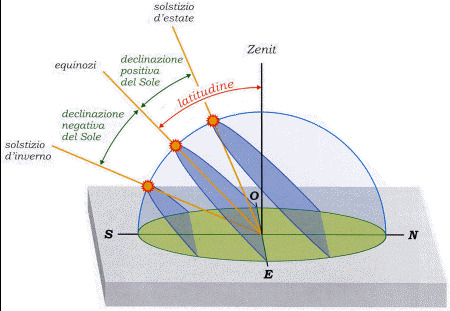
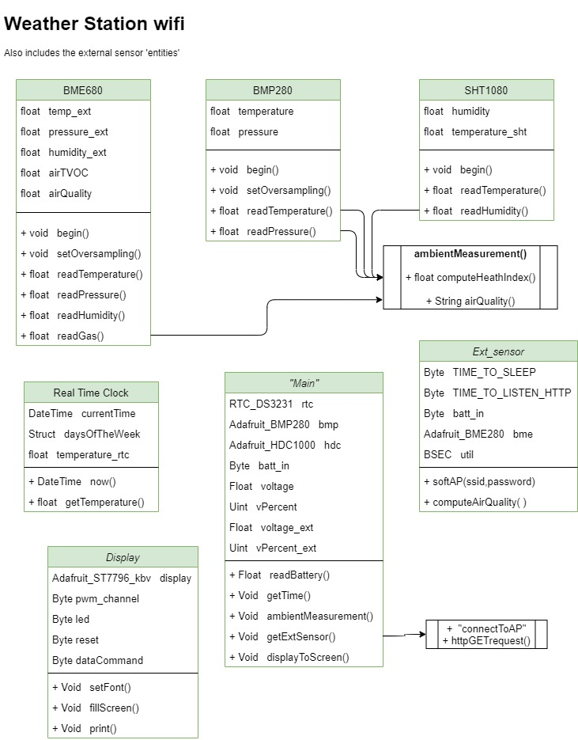

# Weather Station w/ wireless External Sensor and Web Forecast

The aim of this project is to build a very complete weather station with forecast, clock and date.  
This device measures the most relevant ambient parameters, like:

- Temperature
- Pressure
- Humidity  
(all three in & out)  

- Air quality index - tVOC  (with textual indication).
- Heat index (Humidex)
- Battery voltage and percentage (both in & out)

>Illuminance is intentionally not measured because of the need to expose the control unit to the direct sun.  
In addition a single light sensor would not be able to give a correct reading because of the parabolic trajectory of the sun.  
Furthermore, the movement path of the sun is not the same during an year nor in different latitudes.
>
>Similar argumentation for the wind gusts and direction: very bulky sensor and usually not so relevant (at least in my location).  

<br><br>

The core of all is an **ESP-32 Dev. board** but an external wireless "probe", created via an ***ESP8266 D1 Mini***, is used to outside ambient surveys.  
By connecting to its SoftAP wireless network, this smaller control unit will answer to HTTP requests and send sensor data in the payload to the *"master"*.

In addition to the local captured data, a **weather forecast** is downloaded by a free online weather API such as [OpenWeatherMap](https://openweathermap.org/).  

All the information will be displayed on a ***TFT screen*** to achieve a fine eye-looking result.  

The project is developed in **Arduino code language (Wiring)**, to get an easy to understand and multi-platform environment.

### Credits and licence notes
All my code is *free and open source* but...  
**Any redistribution or reproduction of any part of the contents, in any form is prohibited**, following this rules:

1. It can be used just for non-commercial use and by indicating my name [@Alesimattia](https://github.com/alesimattia/Weather-station-wifi) and my references alesimattia@gmail.com  
2. It is in any case prohibited to transmit it or store it in any other website or other form of electronic retrieval system for commercial purposes.

All the libraries I used are free and installable by the Arduino library manager, except for the TFT display one: many thanks to [prenticedavid](https://github.com/prenticedavid).  

>You can freely contact me for any questions or improvements at my email [alesimattia@gmail.com](mailto:alesimattia@gmail.com)  
I'm not an English native speaker so there may be some grammatical errors sometimes. :satisfied:

## Bill of Materials

- ESP32 Dev-board (or whatever microcontroller you like).
- ESP8266 D1 Mini &nbsp; &rarr; *External*
- BME280: &nbsp; temperature, pressure and humidity.
- BME680: &nbsp; temperature, pressure, humidity, total volatile-organic-compounds  &rarr; *External*
- DS3231 &nbsp; Real time clock
- TP4065 &nbsp; li-ion battery charger (x2) + 1N4007 diode (not the best)
- 18650 Battery &nbsp;(x2)
- TFT Display - 4.0" ST7796S (or whatever you like)
- 1 MOhm resistors &nbsp; (x4)
- Two housing cases
- Matrix board &nbsp; *(optional)*

All components can be bought on the most famous sites: cheap [Aliexpress](www.aliexpress.com) or [Adafruit](www.adafruit.com)

#### Notes on components

1. Aliexpress scammed me so I got a BMP280 (no humidity) so in this project will be used a **BMP280** coupled with a HDC1080.  
Code would even be simpler (and lightweight) with a single ambient sensor.
2. Real time clock might be superfluous with an ESPxx but it has got an embedded button cell battery (CR2032) so time keeping is guaranteed. Thus no need to reprogram with a PC even in case of completely loosing power.

## Class Diagram

Portrays the components properties and functions.  
Even if we are not describing a real object language classes, this diagram gives an **overview** of the components and their interactions.



## Display

In this project i'm using a 4.0" 480x320px TFT display with ST7796S controller (maybe not the most widespread, but good price-to-size on AliEx.)  
More documentation on (http://www.lcdwiki.com/4.0inch_SPI_Module_ST7796).  

Most common library is Adafruit_GFX (plus Adafruit_TFTSPI) but a [customised and already set-up one](https://github.com/prenticedavid/Adafruit_ST7796S_kbv) made my life easier.  

The best API would have been this [TFT_eSPI](https://github.com/Bodmer/TFT_eSPI) that is specially optimised for ESP microcontrollers, but the configration is an hassle :sweat_smile:.  
*(Feel free to let me know your custom configuration of this library for this display :smirk:)*

**Touch screen** has not been used: maybe I will implement a touch display-dimming function in the future.  
At the moment display dimming is code-scheduled.

##### NOTES #####

1. For somewhat reason, software SPI connection is working at very slow speeds (I haven't the hardware to measure what, but VERY slow).  
2. With Hardware SPI connection can achieve up to 79 MHz speed with an ESP32 and the hertz rate can be set by code.


### Images

Picture are stored in the ESP filesystem by mapping in RGB565 format (uint16_t array).

```cpp
const unsigned short img[] = PROGMEM {}
const uint16_t img[] = PROGMEM {}
```

You can use [Image2Bitmap](./docs/Image2Bitmap.exe) software for the **mapping**, then  
`Adafruit_GFX::drawRGBBitmap( )` is the public method for displaying to the screen.  
Another online software is: http://www.rinkydinkelectronics.com/t_imageconverter565.php

The main aim is to display a small icon of the weather forecast: this data is downloaded by a free web service such as [OpenWeatherMap](https://openweathermap.org/) with an HTTP call.  

Note that **images size** can't be dinamically resized and when displayed on the screen it must be "printed" with its actual size: the *drawRGBBitmap( )* method must get as parameters full image size.
>I.e. you can't (map in array) a 1920x1080px image and then scale down to 480x320px to fit the screen &rarr; **resize image before mapping** in array.

Background-filling colors also, are expressed in Hex RGB565 and can be converted with http://drakker.org/convert_rgb565.html  
or using a 24bit rgb:

```cpp
Adafruit_GFX::setTextColor( Adafruit_GFX::color565(255,255,255)
```

## Battery measurement

## External ESP sensor